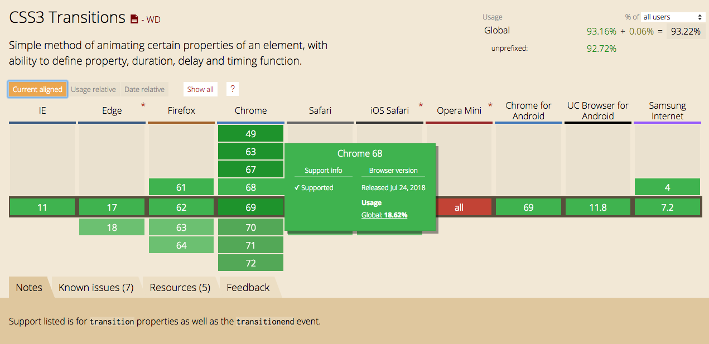
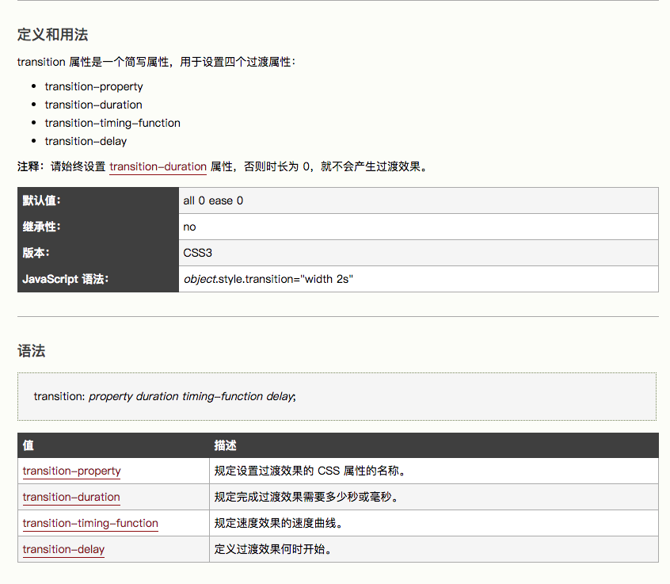
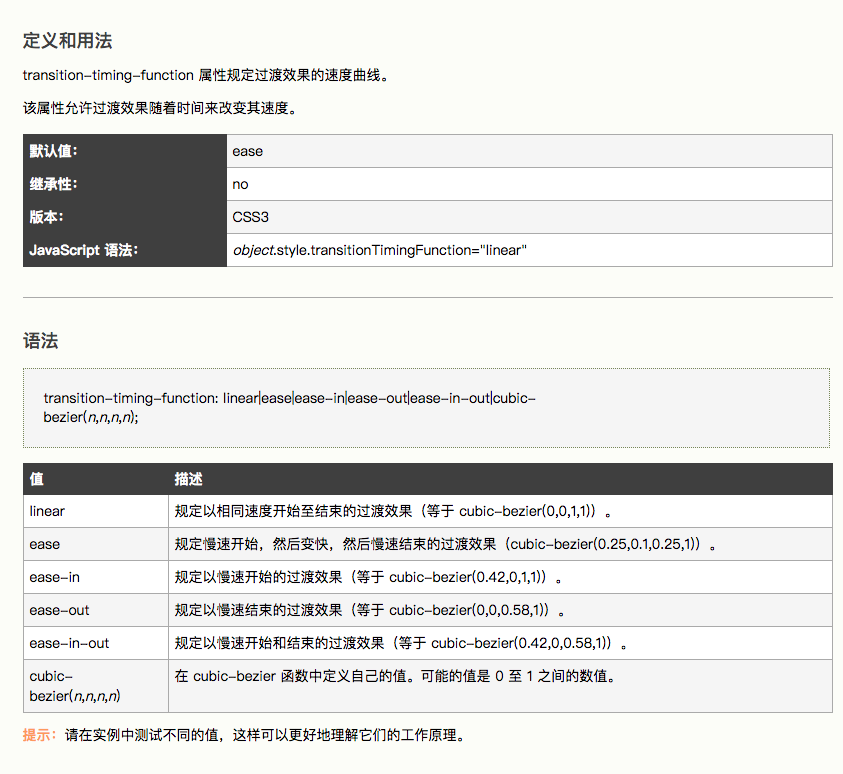
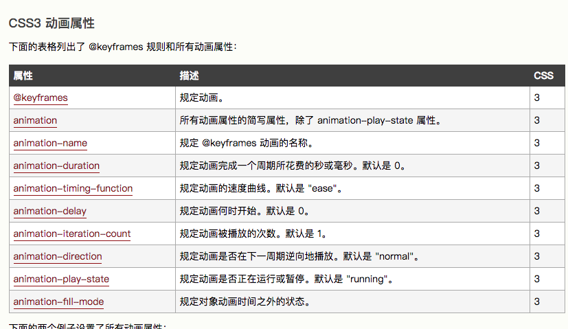

## CSS 动画

> 在进入魅族实习的时间里，` css 动画 `是占据一个很大比例的学习和实践的部分；

### CSS 动画三大特性

- 转换 `transfrom` ---> 改变元素尺寸，状态，位置；
- 过渡 `transition` ---> 指定状态变化所需要的时间, `transition` 只能定义开始状态和结束状态;同时只能依靠事件发生该属性，例如：`img:hover{}`;
- 动画 `animation` 和 `@keyframes`; ---> 为了解决 `transition` 只有2个状态而生，能定义中间的各个阶段的状态;并且不需要依靠事件发生；

### 兼容性

1. 对于 `transition` 属性



### 用法

1. 过渡 `transition`:
用法： ` transition: property duration timing-function delay; ` <br><br>
如图：<br>

**难点**在于 运动的曲线函数 ` timing-function `:<br><br>


**温馨提示：这里可以使用工具，来测试**[transition delay的工具](http://cubic-bezier.com/#0,.71,1,.2s)

2. 动画 `animation` 和 `@keyframes`
    + `@keyframes` 规定了内部中间的运行过程；
    + `animation` 则是实际起作用的属性，里面有规定运行时间、延迟时间、循环次数等等属性；
    + **重点：** 两者是通过 `class` 类来链接；

用法：<br>
```js
    img{
        animation: anima-first 5s;
    }
    @keyframes anima-first {
        0%{},
        100%{}
    }
```
如图：<br>
 <br>


#### 参考链接
- [CSS动画简介](http://www.ruanyifeng.com/blog/2014/02/css_transition_and_animation.html)

#### css 动画工具
- [transition delay的工具](http://cubic-bezier.com/#0,.71,1,.2s)