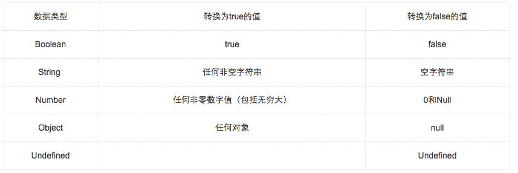
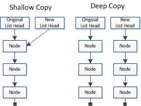

## 📚 es基础

### js的数据类型？
> 一共定义了7种数据类型;
- `NULL`
- `undefined`
- `number`
- `string`
- `boolean`
- `Symbol`
- `object`

### js数据类型中哪些传值和传址？
- 传值 变量是放在 `栈` 中；
    + `null`
    + `undefined`
    + `string`
    + `boolean`
    + `number`
- 传址 变量是放在 `堆` 中； 
    + `object` ( `function` , `Array` , `RegExp` , `Date`)


> 堆和栈的区别？(拼多多笔试题)

- A:
    + `堆` , 队列优先,先进先出,内存由操作系统自动分配释放 ，变量实际保存的是一个指针，这个指针指向另一个位置
    + `栈` ，先进后出，动态分配的空间 一般由程序员分配释放，js里面传值的数据类型是简单数据段，数据大小确定，内存空间大小可以分配

### 传址和传值 代码判断
- 点击这里[传值和传址](./es-base1.js)
```js
    var obj = {
        a: 1,
        b: [1,2,3]
    }
    var a = obj.a
    var b = obj.b
    a = 2
    b.push(4)
    console.log(obj, a, b) // {a:1,b:[1,2,3,4]} , 2 , [1,2,3,4]
```
> 我总结了一句话 :  
> 最后碰上传值的永远传值，碰上传址的永远在传值;

#### 关于一些偏门小知识：
> 摘自犀牛书:
JavaScript数字类型采用IEEE754标准定义的64位浮点数表示数字


### 如何判断js数据类型？
> 4种判断方法
- `typeof 数据类型` 
    + `typeof xxx`得到的**结果**有以下几种类型：`undefined ``boolean`` number`` string ``object`` function``symbol `.
        + `typeof null`结果是`object `，实际这是typeof的一个bug，`null`是原始值，非引用类型
        + `typeof [1, 2]`结果是`object`，结果中没有array这一项，引用类型除了`function`其他的全部都是`object`
        + `typeof Symbol()` 用`typeof`获取`symbol类型`的值得到的是`symbol`，这是 ES6 新增的知识点...
- `instanceof` : `A instanceof B，如果 A 是 B 的实例，则返回 true,否则返回 false`
    + 个人认为是可以作为 `typeof xxx` 之后无法判断 `址引用` 数据类型的进一步判断
    + 例如
    ```js
    [1,2] instanceof Array ;   <!-- true -->
    {} instanceof Object;    <!-- true -->
    new Date() instanceof Date;   <!-- true -->
    ```
    [点击es-base2.js](./es-base2.js)
- `constructor`
    + 表达式： `[].constructor === array` (返回 `true`s 或者 `false` )
    + 是基于原型属性的 `prototype` 原理 
    
    > 所有的函数，都有一个prototype属性，属性值也是一个普通的对象
    
    + 注意： `null` `undefined` 是不会返回值的，因为他们表示 `无` ，没有属性;

- `tostring` 用法
    + `toString()` 是 `Object` 的原型方法，调用该方法，默认返回当前对象的` [[Class]] `。这是一个内部属性，其格式为 `[object Xxx] `;
    + 表达式： `Object.prototype.toString.call('') ;   // [object String]`


### js中的对象：

> JS中，可以将对象分为“内部对象”、“宿主对象”和“自定义对象”三种。
1. 内部对象

    js中的内部对象包括`Array、Boolean、Date、Function、Global、Math、Number、Object、RegExp、String`以及各种错误类对象，包括`Error、EvalError、RangeError、ReferenceError、SyntaxError和TypeError`。
    其中 `Global` 和 `Math` 这两个对象又被称为“内置对象”，这两个对象在脚本程序初始化时被创建，不必实例化这两个对象。

2. 宿主对象

    宿主对象就是执行 `JS脚本` 的环境提供的对象。对于嵌入到网页中的JS来说，其宿主对象就是浏览器提供的对象，所以又称为浏览器对象，如`IE、Firefox` 等浏览器提供的对象。不同的浏览器提供的宿主对象可能不同，即使提供的对象相同，其实现方式也大相径庭！这会带来浏览器兼容问题，增加开发难度。
    浏览器对象有很多，如` Window ` 和 `Documen` ，`Element` ，`form` ，`image` ，等等。

3. 自定义对象

    顾名思义，就是开发人员自己定义的对象。`JS`  允许使用自定义对象，使JS应用及功能得到扩充


### 类型转换




### 🍥   js闭包运用
> 题目：现在有个 HTML 片段，要求编写代码，点击编号为几的链接就alert弹出其编号
- 这里需要使用闭包;
**这是 `html` 代码**
```html
  <ul>
        <li>no1</li>
        <li>no2</li>
        <li>no3</li>
        <li>no4</li>
    </ul>
```
**这是 `js` 代码**

```js
var li_ = document.getElementsByTagName('li')

for(var i = 0 ; i< li_.length; i++){
    li_[i].addEventListener('click',function(i){
       return function(){
            alert(i+0);
            
        }
    }(i),true)
}
```
- 具体代码点击[html代码](./es-update/es-bibao.html)
- 具体代码点击[js代码](./es-update/es-bibao.js)

> 什么是闭包？
- 闭包就是在一个函数里面调用另外一个函数，在被包含的函数形成一个作用域,可以调用包含闭包的函数的局部变量
- 两个例子
    + [code1-bibao](./es-update/code1-bibao.js)
    + [code2-bibao](./es-update/code2-bibao.js)


###  🍥  偏门的js知识点
> 如何让js代码异步加载？(QQ音乐)
- A:
    + 使用动态创建 `script` 标签；
    + 使用 `script` 标签的属性值： `async="async" `,(无序执行，异步);
    + 使用 `script` 标签的属性值： `defer="defer" `,(按照顺序执行，异步);
    + 使用 `eval()` 操作 `ajax` 返回的响应值： `eval(xmlhttp.responseText)`;
    
> `eval()`用来干什么的？（QQ音乐）
- A:
    + 可计算某个字符串，并执行其中的的 `JavaScript ` 代码。
    + `eval()` 可以让写在函数里的代码运行在全局作用域中。

###   🍥  使用纯js实现一段HTML代码？（拼多多）

> 相似的问题，同样出现在 `京东` 的前端在线编程题。

<br>

- 已经在 `京东` 前端在线编程题中有详细解释和例子
[](../moni-exam/moni-jindong/readme.md#关于在线编程题)


###  🍥  this的在javascript中的指向
- A:
> 有4种情况关于 `this` 的走向；

- `在函数里面的this` --->  指向 `全局变量`;
> 例子：

```js
    function funcA(a){
        this.a =a;
    }
    funcA(1)
    console.log(a) // 1
```

<br>

> 代码可见 [this.js](./js-to-test/this.js);


- `在对象方法里面的this` ---> 指向 `当前对象`;
> 例子：

```js
    var point = {
        x:1,
        y:1,
        toIt:function(x,y){
            this.x = this.x + x;
            this.y = this.y + y;
        }
    }
    point.toIt(1,1)
    point.x; // 2
    point.y; // 2
``` 

<br>

> 代码可见 [this_2.js](./js-to-test/this_2.js);


- `作为构造函数里面的this`  ----> 使用 `var that = this` 把 `this` 指向 `对象内部`
> 例子：
```js
    var point = {
        x:1,
        y:1,
        moveIt: function(x,y){
            var that = this;
            function moveX(x){
                that.x = that.x + x;
            }
            function moveY(y){
                that.y = that.y + y;
            }
            moveX(x);
            moveY(y);
        }
    }
    point.moveIt(1,1)
    point.x; // 2
    point.y; // 2
```

<br>

> 代码可见 [this_3.js](./js-to-test/this_3.js);

- `使用 apply 或 call 调用`  --->  指向更换的 `对象` 
> 例子：
```js
    function Point(x, y){ 
        this.x = x; 
        this.y = y; 
        this.moveTo = function(x, y){ 
            this.x = x; 
            this.y = y; 
        } 
    } 
 
    var p1 = new Point(0, 0); 
    var p2 = {x: 0, y: 0}; 
    p1.moveTo(1, 1); 
    p1.moveTo.apply(p2, [10, 10]);

```


- 参考链接 [深入浅出 JavaScript 中的 this](https://www.ibm.com/developerworks/cn/web/1207_wangqf_jsthis/index.html)
- 参考链接 [Understanding JavaScript Function Invocation and "this"](https://yehudakatz.com/2011/08/11/understanding-javascript-function-invocation-and-this/)


### 🚨 如何实现 javascript 的深拷贝？

- `浅拷贝` ：`拷贝对象` 直接复制 `被拷贝对象` 的 `指针` ，**改变拷贝对象的属性值，会一并改变被拷贝对象的属性值**；
- `深拷贝` ：`拷贝对象` 彻底复制 `整个旧对象`，**改变新对象的属性值，并不会对被拷贝对象产生影响**；

> 如下图会理解更彻底:



<br>
(图片来自网络)

> 实现深拷贝：

- `遍历把被拷贝对象中的节点一一赋值给拷贝对象`

```js
   function copyTo(copyobj){
        var newObj = {};
        for(var i in copyobj){
            newObj[i] = copyobj[i]
        }
        return newObj;
    }
```

- `使用 JSON.parse 和 JSON.stringify 配合使用，先转为 json格式，再转为 对象`

```js
    var copyObj = {
        x:1,
        y:1
    }
    var newObj =  JSON.parse(JSON.stringify(copyObj))
```

- `当对象只有一层结构，并没有多层结构时，可以使用 Object.assign() 进行拷贝`

```js
    var copyObj = {
        x:1,
        y:1
    }
    var newObj = Object.assign({},copyObj)
```


> 判断是否是真的进行 `深拷贝` 的方法： 改变 `新对象的一些属性值` , 看是否会影响到 `被拷贝对象` 的值，如果不能改变 `被拷贝对象` 的属性值的话，就是深拷贝，否则，则是浅拷贝

<br>

- 参考链接 [什么是js深拷贝和浅拷贝及其实现方式?](https://www.haorooms.com/post/js_copy_sq)
- 参考链接 [ ES2015系列(二) 理解Object.assign](https://cnodejs.org/topic/56c49662db16d3343df34b13)


### js的运行机制 Event Loop
> A:

- 了解比较少的话，可以参考一下我的博客[📖 javascript的运行机制 Event loop](http://wusiqing.com/?p=328)

> 多是以代码运行题出现


##### 参考链接
- [判断JS数据类型的四种方法](https://www.cnblogs.com/onepixel/p/5126046.html)
- [不得不说的JavaScript异步加载](https://www.cnblogs.com/zichi/p/4597766.html)
- [异步加载JS脚本](https://www.jianshu.com/p/bf8b5bf5fc90)
