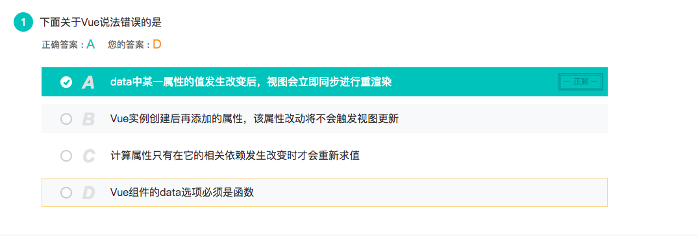
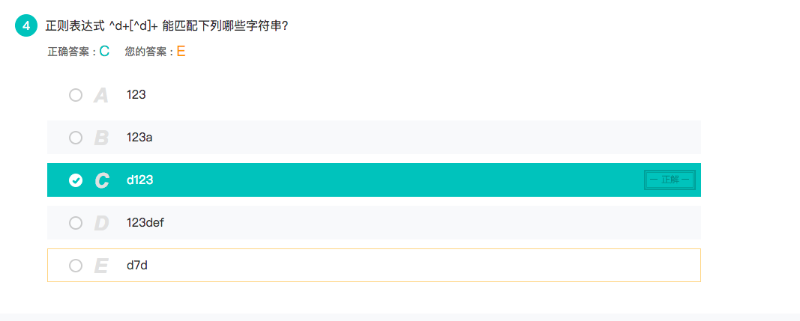
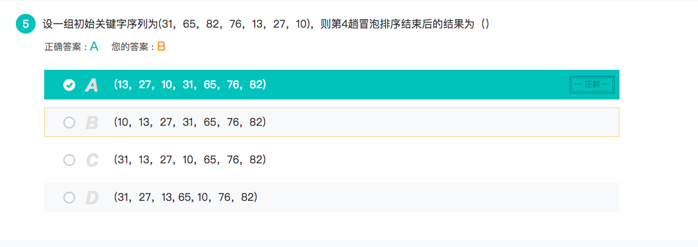
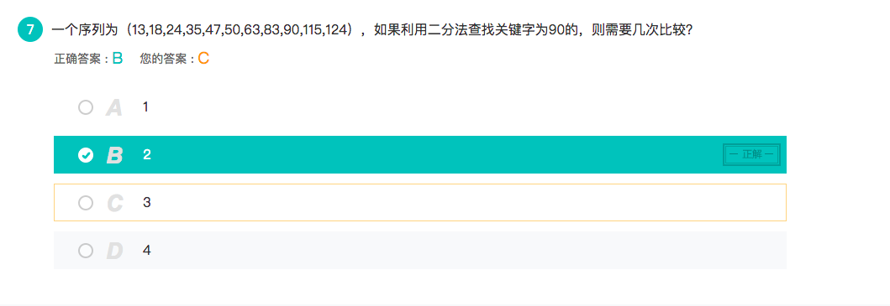
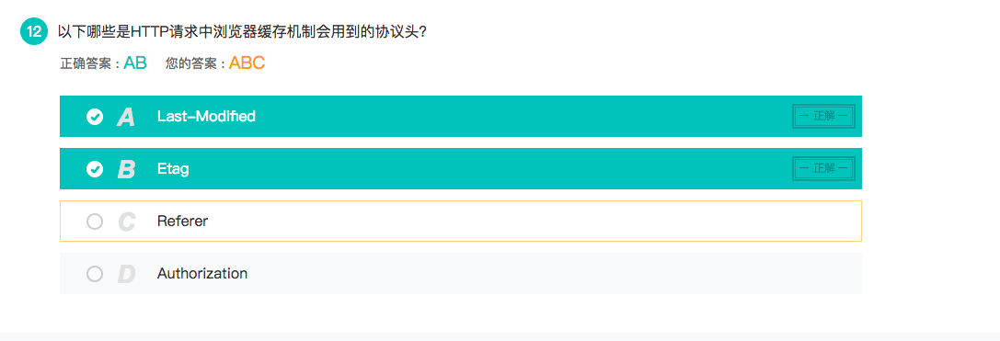
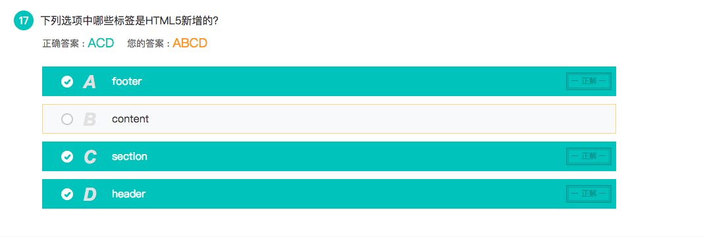
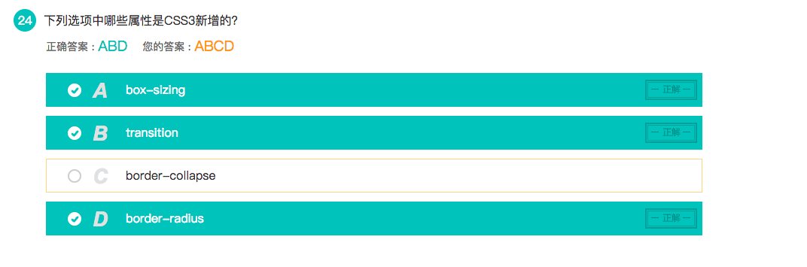
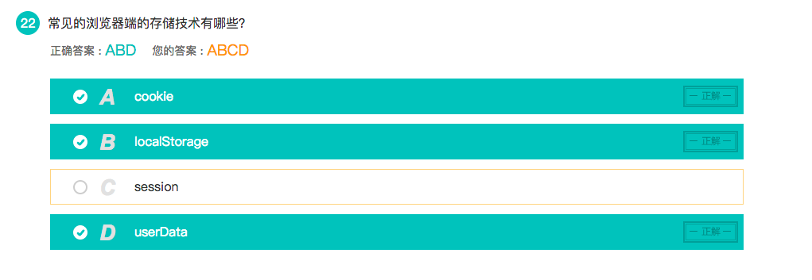
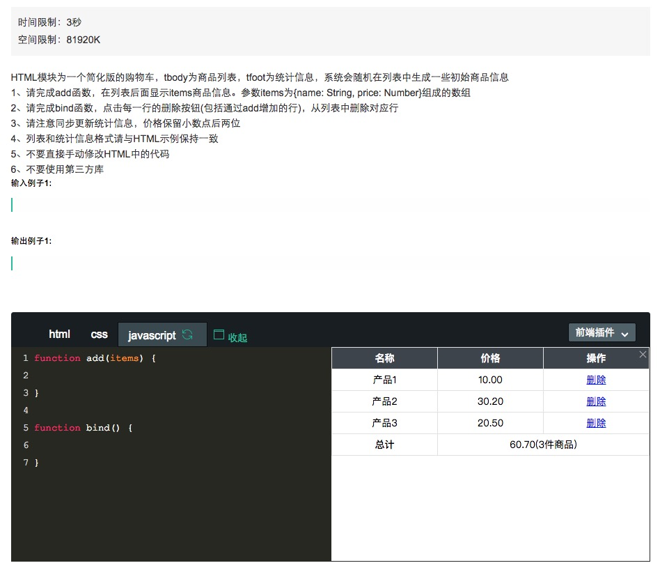

##  🐝 京东 错题系列

###  关于vue

> 试题如下：



- 讨论关于 `vue` 的属性

<br>

### 🌷 关于 正则表达式

> 试题如下：



<br>

-  `正则表达式` 
    + 含义：是一个描述字符模式的对象
    + 用途：
        + 字符匹配
        + 文本检索
        + 文本替换
    + 使用
        + **重点：** 直接是由 ` /  / ` , 一对斜杠组成，按照斜杠里面的规则进行匹配

    + 使用的正则表达式练习 [RegExr](https://regexr.com/)
        

<br>

### 🌷 关于 算法

> 试题如下： 关于 `冒泡算法` 



<br>

- ` 冒泡算法 ` 流程
    1. 比较相邻的元素。如果第一个比第二个大，就交换他们两个。
    2. 对每一对相邻元素作同样的工作，从`开始第一对到结尾的最后一对`。在这一点，最后的元素应该会是最大的数。
    3. 针对所有的元素重复以上的步骤，除了最后一个。
    4. 持续每次对越来越少的元素重复上面的步骤，直到没有任何一对数字需要比较。

- ` 冒泡算法 ` 秘诀
    + **每一轮，都把所在的数数中最大的值，沉在最底下（也就是排在最后）**
    + **有多少个数在列表中，就意味着有多少轮排序**，例如（10，1，9，2），就有 **4轮**排序
    + **在n轮排序后，列表中最大的4个数会在列表末尾**

<br>

##### 解答本题，冒泡算法的遍历：

```js
        ( 31 , 65 , 82 , 76 , 13 , 27 , 10)

        // 上标 ^ 意味着哪两个数在作比较
        round1:
        -> ^31 ^65 82 76 13 27 10
        -> 31 ^65 ^82 76 13 27 10
        -> 31 65 ^76 ^82 13 27 10
        -> 31 65 76 ^13 ^82 27 10
        -> 31 65 76 13 ^27 ^82 10
        -> 31 65 76 13 27 10 82 

        round2:
        -> ^31 ^65 76 13 27 10 82
        -> 31 ^65 ^76 13 27 10 82
        -> 31 65 ^13 ^76 27 10 82
        -> 31 65 13 ^27 ^76 10 82
        -> 31 65 13 27 ^10 ^76 82

        round3:
        -> ^31 ^65 13 27 10 76 82
        -> 31 ^13 ^65 27 10 76 82
        -> 31 13 ^27 ^65 10 76 82
        -> 31 13 27 ^10 ^65 76 82

        round4:
        -> ^13 ^31 27 10 65 76 82
        -> 13 ^27 ^31 10 65 76 82
        -> 13  27 ^10 ^31 65 76 82

        round5:
        -> ^13 ^27 10 31 65 76 82
        -> 13 ^10 ^27 31 65 76 82

        round6:
        -> 10 13 27 31 65 76 82


```

<br>
<br>

> 试题如下：  关于 `二分法`



<br>

- 用到 `二分法` 的情况
    + 二分法查找适用于数据量较大时，但是数据需要先排好顺序

- `二分法` 的秘诀
    + 若a[mid]<x,说明待查找的元素值只可能在比中项元素大的范围内，则把mid+1的值赋给front，并重新计算mid，转去执行步骤2；
    + 若a[mid]>x，说明待查找的元素值只可能在比中项元素小的范围内，则把mid-1的值赋给end，并重新计算mid，转去执行步骤2。
    + 使用的是 **算法排序中下标** ，去寻找数组中 `某个下标的值`;


##### 解答本题，二分法算法的遍历：

``` js
    ( 13 , 18 , 24 , 35 , 47 , 50 , 63 , 83 , 90 , 115 , 124 )

    > 需要查找的数是： 90 

    round1:

        font = 0
        end  = 10
        mid = (font+end)/2 = 5
        所以 a[mid] = 50
        因为 a[mid] < 90 ,所以需要在 `后半段`: ` (  63 , 83 , 90 , 115 , 124 ) `中查找

    round2:

        font = mid + 1 = 6 
        end = 10  
        mid = (font+end)/2 = 8
        所以 a[mid] = 90
        因为 a[mid] = 90 , 所以停止查找
        
```


### 🌷 关于 HTTP 协议

> 试题如下：



### 🌷 关于 HTML5 新标签

> 试题如下：



### 🌷 关于 CSS3 新属性

> 试题如下：




###  🌷 关于 浏览器本地存储
> 试题如下：



> 解析：
这里应该是 `sessionstorage` , 如果是 `session` 的话后端也是有这个 `关键字`;

<br>

### 关于在线编程题

> 试题如下：



<br>
```html
      <table id="jsTrolley">
        <thead><tr><th>名称</th><th>价格</th><th>操作</th></tr></thead>
        <tbody>
            <tr><td>产品1</td><td>10.00</td><td><a href="javascript:void(0);">删除</a></td></tr>
            <tr><td>产品2</td><td>30.20</td><td><a href="javascript:void(0);">删除</a></td></tr>
            <tr><td>产品3</td><td>20.50</td><td><a href="javascript:void(0);">删除</a></td></tr>
        </tbody>
        <tfoot><tr><th>总计</th><td colspan="2">60.70(3件商品)</td></tr></tfoot>
    </table>
```
<br>
```css
    body,html{
    padding: 0;
    margin: 0;
    font-size: 14px;
    color: #000000;
    }
    table{
        border-collapse: collapse;
        width: 100%;
        table-layout: fixed;
    }
    thead{
        background: #3d444c;
        color: #ffffff;
    }
    td,th{
        border: 1px solid #e1e1e1;
        padding: 0;
        height: 30px;
        line-height: 30px;
        text-align: center;
}
```
<br>

> 这是要补全的代码； 
- 分了两部分
    + [add 函数](#add函数)
    + [bind 函数](#bind函数)

#### add函数    

##### 第一种方法：

> 推荐第一种方法：

```js
    /** 
     *  核心：
     * 使用字符串形式的函数:
    1. 获取父元素节点；
    2. 创造新的 tr 节点；
    3. 把字符串放进 tr 节点里面；
    4. 把 tr 节点放进 tbody_的 appendChild() 里面；
    5. 循环遍历上诉操作 
    比较推荐这种；
                    **/
    function add(items){
        var html = '';
        var tbody_ = document.getElementsByTagName('tbody')[0];
        for(var i in items){
        var tr_ = document.createElement('tr');    
        // 转换 Number 数据类型，保留2位小数
        var fix2 =  items[i].price;
        var num_price = new Number(fix2);   
        
        html = ' <tr><td>'+items[i].name+'</td><td>'+num_price.toFixed(2)+'</td><td><a href="javascript:void(0);">删除</a></td></tr>'
        tr_.innerHTML = html;
        tbody_.appendChild(tr_);
    }
        
    }
```

##### 第二种方法：

> 和拼多多的用 `纯js` 的考查是一样的

```js
    /**
     *  纯js写的
     */
    function add(items) {
        var html = '';
        var tbody_ = document.getElementsByTagName('tbody')[0];
        for(var i in items){
            var tr_ = document.createElement('tr');
            var td_1 = document.createElement('td');
            var td_2 = document.createElement('td');
            var td_3 = document.createElement('td');
            var a_ = document.createElement('a');
            td_1.innerText = items[i].name;

            var fix2 =  items[i].price;
            var num_price = new Number(fix2)   
            td_2.innerText = num_price.toFixed(2);

            a_.setAttribute('href','javascript:void(0);');
            a_.innerText='删除';
            tr_.appendChild(td_1);
            tr_.appendChild(td_2);
            td_3.appendChild(a_);
            tr_.appendChild(td_3);
            tbody_.appendChild(tr_)
        }
    }

```

> 这里主要考查操作DOM，是必要的知识点，同时考验熟练度。

- 关于纯js操作DOM，可以参考[我的一篇文章](http://wusiqing.com/?p=337)

#### bind函数  


<br>

- 返回 [首页目录](../../README.md)

