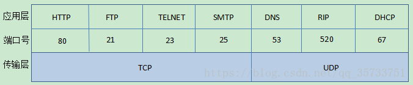
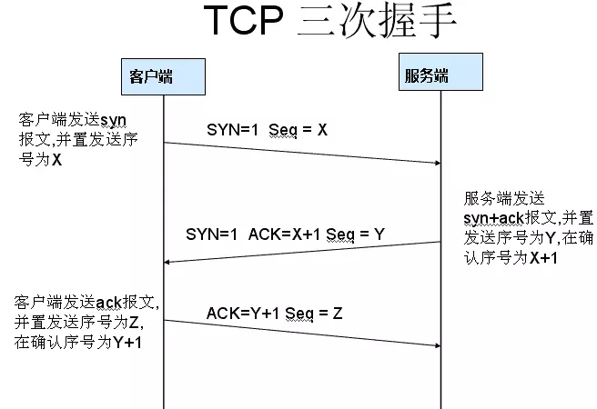
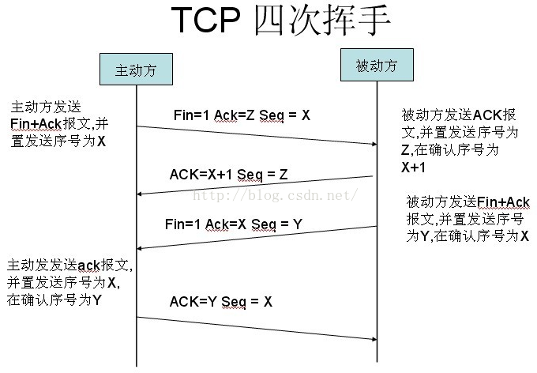
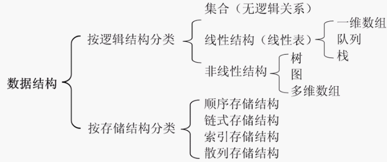

### 📖 模拟笔试题

> 文章中的答案是自己给出的，不确定是不是标准答案，仅供参考

## 01.jpeg (涉及数据库)
> A:
- `索引` ：是对数据库表中 `一列` 或 `多列` 的值进行排序的一种结构，使用索引可快速访问数据库表中的特定信息。
> 一些关于 `索引` 和 `索引查询` 的注意点：
```sql
    就目前来说，mysql 暂时只支持最左前缀原则进行筛选。
    例子：创建复合索引
    create index idx_a_b_c on tb1(a,b,c)
    只有使用如下条件才可能应用到这个复合索引
    1.where a=?
    2.where a = ? and b = ?
    3.where a = ? and b = ? and c = ?
    但
    4.where a = ? and c ＝ ？
    只会使用到mysql 索引 a 列的信息
```
- 可以参考[mysql数据库正确建立索引及使用](http://blog.51cto.com/4925054/1097107)
- 可以参考[MySQL 数据库索引使用场景 & 注意事项](https://juejin.im/entry/58ef200144d904006cdf29c2)

<br>

> 答案是：C、D

## 02.jpeg (涉及 linux操作系统)
> A:
1. 管道（pipe）,流管道(s_pipe)和有名管道（FIFO）
2. 信号（signal）
3. 消息队列
4. 共享内存
5. 信号量
6. 套接字（socket)

- 参考链接[Linux进程间通信的几种方式总结](https://blog.csdn.net/gatieme/article/details/50908749)

> 答案是：all

## 03.jpeg （涉及操作系统设计）
> A： 😣 有点儿难呀

> 涉及到 `生产者和消费者问题` 
> 标准的 `生产者和消费者问题` 应该如下图：
```js
    MUTEX = 1;
    FULL = 1;
    EMPTY = 消费个数;
```
```js
    <!-- 生产者进程 -->
    while(1) {
        P(EMPTY); // 减少一个空缓冲区个数
        P(MUTEX); // 在任意一个时刻，只能有一个进程去操作它
        if (cake < 5) {  //假设消费个数是 5
            cake++;
        }
        V(MUTEX); // 在任意一个时刻，只能有一个进程去操作它
        V(FULL); // 增加一个蛋糕个数
    }
```

```js
    <!-- 消费者问题 -->
    while(1) {
        P(FULL); // 减少一个蛋糕个数
        P(MUTEX); // 在任意一个时刻，只能有一个进程去操作它
        if (cake > 0) {
            cake--;
        }
        V(MUTEX); // 在任意一个时刻，只能有一个进程去操作它
        V(EMPTY); // 增加一个空缓冲区个数
    }
```

- 个人可能觉得的答案在 [issues 7](https://github.com/heycqing/KillTime/issues/7) 中。
- 欢迎解答和纠正 🐾 

## 04.jpeg (涉及网络协议)
> Q:DNS是应用层协议，应用了哪些传输层协议


<br>
(图片来源于网络)
- `DNS` 主要是使用 `UDP协议`,
- 但是由于 `TCP ` 和 `UDP` 的字节限制，导致 `DNS` 会在某些情况下使用 `TCP` 协议；

> 答案是： TCP/UDP
- 参考链接 [传输层协议和应用层协议](https://blog.csdn.net/qq_35733751/article/details/80114251)；
- 参考链接 [TCP/UDP端口列表](https://zh.wikipedia.org/wiki/TCP/UDP%E7%AB%AF%E5%8F%A3%E5%88%97%E8%A1%A8)
- 参考链接 [关于 TCP/IP，必知必会的十个问题](https://juejin.im/post/598ba1d06fb9a03c4d6464ab)
- 参考链接 [DNS分别在什么情况下使用UDP和TCP](https://www.cnblogs.com/549294286/p/5172435.html)


## 05.jpeg （涉及到 网络协议）
- A:
- 可见下表（详解）:



<br>
- 中间是 `数据传输过程` ;
<br>



> 图片来源于网络

> 个人感觉答案是： A B

## 06.jpeg (涉及 操作系统内存)
- A:
> 详情如下表：


<br>

我这里编写了代码
```c
    #include <stdio.h>
    #include <limits.h>
    #include <string.h>
    int main(){
        char str[][20] = {"hello","tencent"};
        char *p = str[0];
        int dim = sizeof(str)/sizeof(str[0]);
        int **p1;
        int *p2[10];
        int (*p3)[10];
        printf(" %d %lu %lu %lu %lu %lu\n",dim,sizeof(str),strlen(p),sizeof(p1),sizeof(p2),sizeof(p3));
        return 0;
    }
```

- 代码具体[06.c](./c/06.c)

使用了 `命令行` 编译得出编译后的文件是 [a.out](./c/a.out)

<br>

- 使用 `a.out` 文件: 把 `a.out` 放在命令行中直接 `回车` 运行就可以了。

> 答案是：A： 2 40 5 8 80 8

## 07.jpeg (涉及 js中this指向)
- A:

<br>

图片中的 `this` 指向的是 `window` 的全局变量；

<br>

> 答案是：A

## 08.jpeg (涉及 C++ const关键字的引用)
> A:

> 这道题，自我感觉不是很好，作为一道底层语言题，对于前端确实是有点难；

-[见issues8](https://github.com/heycqing/KillTime/issues/8)

- 参考链接 关于 `auto` 关键字的 [LESSON #1: ‘AUTO’](https://mbevin.wordpress.com/2012/11/13/auto/)
- 参考链接 关于 `const` 关键字的 [C/C++中const关键字详解](https://www.cnblogs.com/yc_sunniwell/archive/2010/07/14/1777416.html)


## 09.jpeg (涉及数据结构)
> A:

> 如下表详情：



